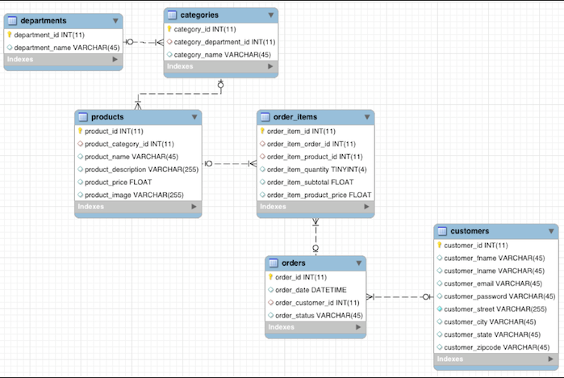
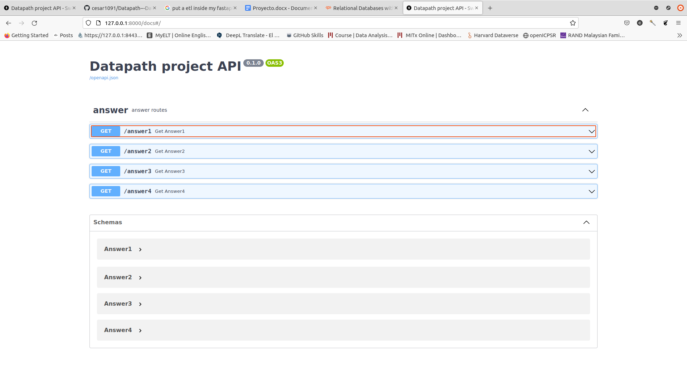
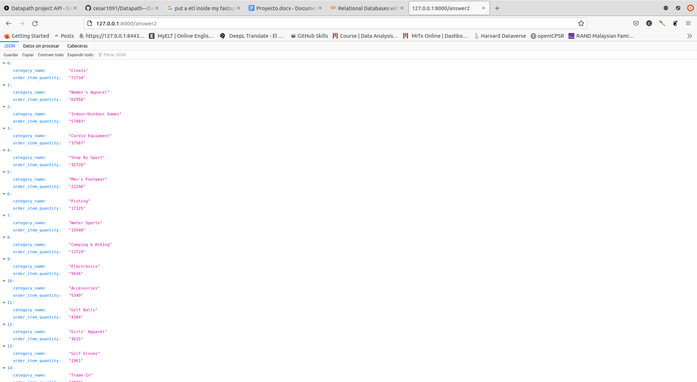
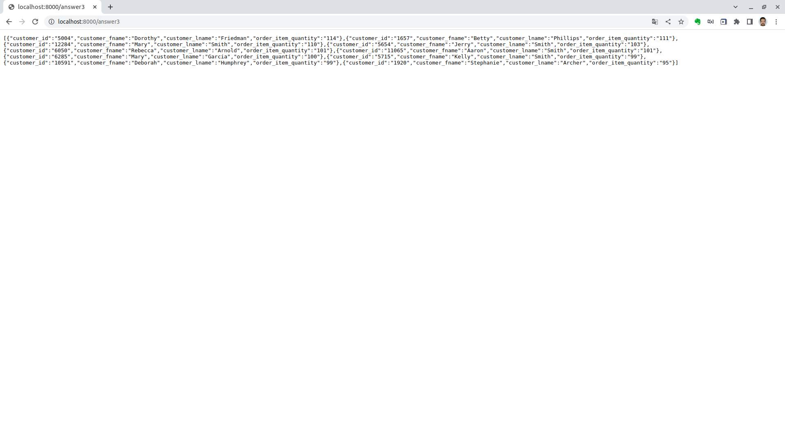
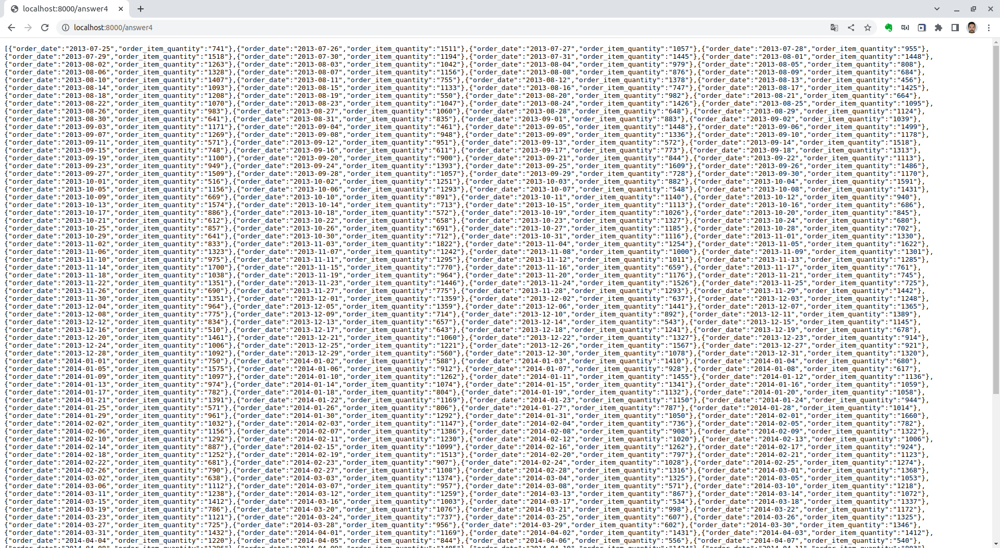

# Datapath---Data-Engineering-with-python

El presente proyecto consta de tres partes, el desarrollo de la base da datos en MySQL, el desarrollo de la ETL, y la creación de una API con el módulo FastAPI de python para la disponibilización de la informacion con el objetivo de responder las siguientes cuatro preguntas:

* __Pregunta 1__: ¿Cuáles son los ingresos por departamento?
* __Pregunta 2__: ¿Cuáles son las categorías más compradas? (identificar el nombre de la categoría)?
* __Pregunta 3__: ¿Quiénes son el top 10 de clientes que generan más compras para fidelizarlos?
* __Pregunta 4__: ¿Cuales son las ventas historicas realizadas?

## Parte 1: Desarrollo de la base de datos

Para generar la base de datos se genero un script de SQL que genera el siguiente schema:

Para generar la base de datos de en su **MySQL**, debera correr el bash script agregando su usuario, contraseña y la ruta del script **SQL**

`executeMySql.sh user password path_sql_script`

Luego tendrá preparada la base de datos relacional con la cual trabajaremos.

## Parte 2: Desarrollo de la ETL

La **ETL** generada consulta la base de datos y hace un join entre las tablas del schema anterior con el objetivo de transformarlas mediante una estrategia de agrupación con el objetivo de generar la información que resuelva las preguntas previamente planteadas.

Esta **ETL** se automatiza mediante `crontab` y actualizará las tablas *answer1, answer2, answer3, answer4* el primero de cada mes a las 8:00 a.m.

Para que pueda programar la actividad en su `crontab`, ejecute el siguiente bash script:

`etl.sh`

## Parte 3: Disponibilizar la información

Para disponibilizar la información, se generó un **API** que envie los resultados de las tablas *answer1, answer2, answer3, answer4* actualizada los primeros de cada mes. Para poder iniciar el **API** debe escribir el siguiente comando en consola:

`uvicorn api:app --reload`

Una vez iniciado la api, tendrá disponible la data que responde las siguientes preguntas:

Y en cada `GET` podra conectar con la información que responde las preguntas anteriormente mencionadas.

