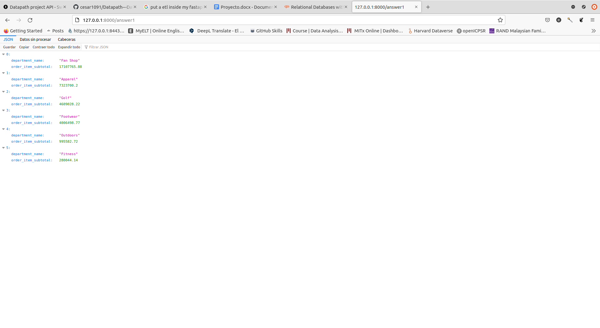

# Datapath---Data-Engineering-with-python

Para inicializar el api correr en consola:

 `uvicorn api:app --reload`

Una vez iniciado la api, tendrá disponible la data que responde las siguientes pregruntas:

* __Pregunta 1__: ¿Cuáles son los ingresos por departamento?
* __Pregunta 2__: ¿Cuáles son las categorías más compradas? (identificar el nombre de la categoría)?
* __Pregunta 3__: ¿Quiénes son el top 10 de clientes que generan más compras para fidelizarlos?
* __Pregunta 4__: ¿Cuales son las ventas historicas realizadas?

Y en cada `GET` podra conectar con la información que responde las preguntas anteriormente mencionadas.

